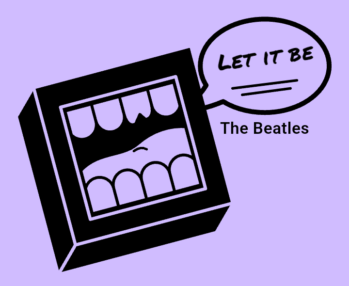
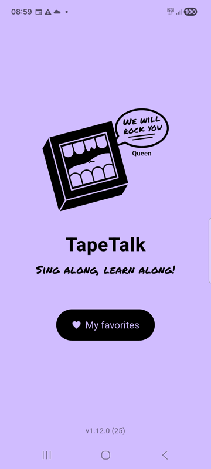
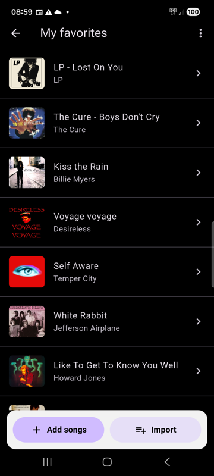
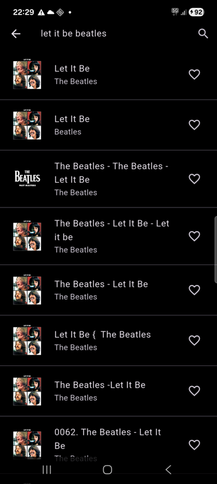
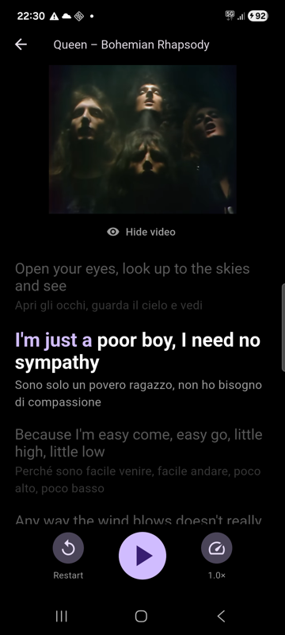
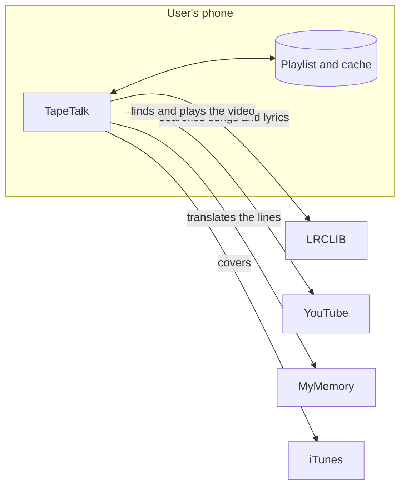
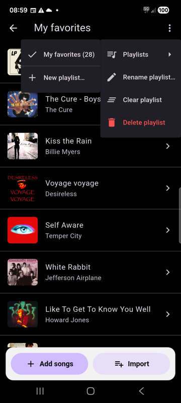
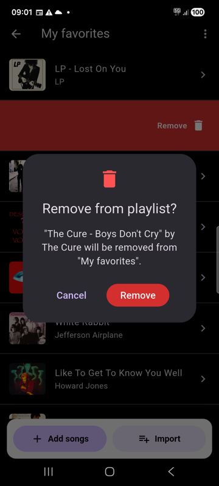
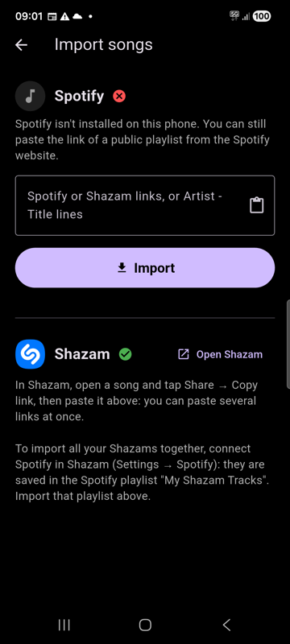

<p align="center">
  
</p>

# TapeTalk

**Sing along, learn along!**

TapeTalk is an Android app (Flutter) for learning English with songs: while
the music plays, the English lyrics scroll in time, each word turns purple as
it is sung, and an Italian translation appears under every line.

<p align="center">
  
  
  
  
</p>

## Architecture

TapeTalk **has no server and no accounts**. It is just a tool: it takes a link
that already exists (the song's video on YouTube) and turns it into something
useful for learning English, by putting the synced lyrics and their
translation next to it.

- **The playlist lives on the user's phone.** Favorites are stored only there
  (`shared_preferences`): everyone has their own, nobody else sees them and
  they never go through a server. Uninstalling the app deletes them.
- **No song content is in the code.** Audio, lyrics, translations and covers
  are fetched on demand from public services and, when useful, cached on the
  phone.
- **A song is just a reference**: title, artist, YouTube video ID and
  duration. The app derives everything else from these.



## Features

- **My playlist** (*My favorites*): everyone builds their own playlists,
  saved on the phone. When the list is empty, the app invites you to create one.
- **Search for new songs** by title or artist and add them with the heart.
  Only songs with synced lyrics are shown; the right YouTube video is picked
  by matching the song's duration.
- **Bar fixed at the bottom of the playlist** with the purple **Add songs**
  button and the **Import** button (Spotify or Shazam), always visible while
  scrolling (modelled on the mobile bar of roomee.dk).
- **Several playlists**: the menu at the top right manages them, in levels.
  *Playlists* opens the list to switch from one to another or create a new
  one; then *Rename*, *Clear* (remove all songs) and *Delete* the open
  playlist, with confirmation. The heart, the search and the import work on
  the open playlist.
  <br>
- **Remove songs** from the playlist by swiping them to the left (or with
  the heart): a dialog asks for confirmation, and **Undo** puts them back.
  Removing a song from its own screen takes you back to the playlist.
  <br>
- **Import from Spotify and Shazam** by pasting links: a public Spotify
  playlist, or Shazam song links (several at once, or the whole text Shazam
  shares). A plain list also works, one song per line as *Artist - Title*. Songs without synced lyrics are skipped. To import all your
  Shazams at once, connect Spotify in Shazam: they are saved in the Spotify
  playlist *My Shazam Tracks*. The import screen shows the Spotify and Shazam
  logos and whether the apps are installed on the phone.
  <br>
- **Lyrics in time with the music**: the current line is highlighted and
  **each word turns purple as it is sung**. Line timings come from LRCLIB.
  When the video has YouTube's automatic English captions, each word uses its
  real timing from them; otherwise word timings are estimated from the length
  of the words.
- **Eye button** under the video to hide it while reading and listening: the
  video is only hidden, not stopped, so the music keeps playing and the lyrics
  get more room.
- **Italian translation** under every line.
- Pause / Play, **Restart** and playback **speed** (1× · 0.85× · 0.75×)
  without distorting the voice.
- **Logo**: a mouth-box drawn in the style of a painting, with a speech bubble
  that cycles through lines from famous songs and the singer's name
  (*Let it be* – The Beatles, *We will rock you* – Queen, *Imagine* – John
  Lennon, *Stayin' alive* – Bee Gees, *I will survive* – Gloria Gaynor).
  The app icon uses the same mouth-box, without the bubble.
- **Version number** at the bottom of the home screen, so you can tell which
  version is on each phone.

The interface is in English; the translations under the lyrics are in
Italian.

## Where the data comes from

| What | Source |
|---|---|
| Song search and synced lyrics | [LRCLIB](https://lrclib.net) |
| Video and audio | YouTube: search with [youtube_explode_dart](https://pub.dev/packages/youtube_explode_dart), playback with the embedded player |
| Word timings | YouTube's automatic captions, when available |
| Playlist import | Spotify's public embed page for the playlist; Shazam's public song pages |
| Translations | [MyMemory](https://mymemory.translated.net) |
| Covers | iTunes Search API |

> ⚠️ Experimental project for personal use. Song lyrics and their
> translations are copyrighted: LRCLIB and MyMemory do not provide a license
> to display them, so a distributed version of the app would need licensed
> lyrics. The video search also reads YouTube's pages without the official
> API and may stop working if YouTube changes them, and the same goes for the
> Spotify and Shazam import.

## Getting started

```bash
flutter pub get
flutter run
```

Suggested songs are configured in `lib/song.dart` (`catalog`); any other song
can be added from the app with the search.

## Versions

The version number is in `pubspec.yaml` and every version has a git tag.

| Version | What's new |
|---|---|
| 1.12.0 | Several playlists with a menu to switch, create, rename, clear and delete them; simpler bottom bar |
| 1.11.1 | Import button moved into the bottom bar |
| 1.11.0 | Fixed bottom bar in the playlist with the Add songs button |
| 1.10.2 | Import a plain *Artist - Title* list; retries when LRCLIB is busy; better title and accent matching |
| 1.10.1 | Fix: Shazam links imported the wrong song; imported songs must match title and artist |
| 1.10.0 | Import Shazam song links; Spotify and Shazam logos; back to the playlist after removing a song |
| 1.9.2 | "Import from Spotify or Shazam" button at the top of the playlist |
| 1.9.1 | Confirmation dialog before removing a favorite |
| 1.9.0 | Remove songs with a swipe; import playlists from Spotify (and Shazam via Spotify) |
| 1.8.2 | The video restarts by itself if it doesn't start on its own |
| 1.8.1 | Eye button moved under the video |
| 1.8.0 | Real word timings from YouTube's automatic captions; eye button to hide the video |
| 1.7.3 | Bigger video player (356×200), as required by YouTube |
| 1.7.2 | Old Musixmatch translations deleted from the phone |
| 1.7.1 | Musixmatch removed: translations only from MyMemory |
| 1.7.0 | Whole interface in English |
| 1.6.1 | *My favorites* button in English |
| 1.6.0 | Words turn purple as they are sung |
| 1.5.0 | Song lines in the logo; purple button and invitation to create a playlist |
| 1.3.1 | New logo and icon with the mouth-box |
| 1.2.0 | Search for new songs; version number in the app |
| 1.1.0 | Personal favorites saved on the phone |
| 1.0.0 | First version |

## Project structure

- `lib/main.dart` – home screen, playlist, search, song screen
- `lib/favorites_store.dart` – the playlist, saved on the phone
- `lib/song_search.dart` – song search (LRCLIB) and video search (YouTube)
- `lib/playlist_import.dart`, `lib/import_screen.dart` – Spotify playlist import
- `lib/installed_apps.dart` – checks whether Spotify and Shazam are installed (Android code in `MainActivity.kt`)
- `lib/song.dart` – song model and suggested songs
- `lib/lyrics_screen.dart` – lyrics in time, purple words and controls
- `lib/lyrics_service.dart` – lyrics and translations
- `lib/word_timing_service.dart` – real word timings from YouTube's automatic captions
- `lib/cover_service.dart` – covers
- `lib/mouth_logo.dart` – mouth-box logo with the song lines
- `test/icon_render_test.dart` – generates the app icon from the logo
- `docs/` – logo and screenshots for this README

## License

[MIT](LICENSE)
