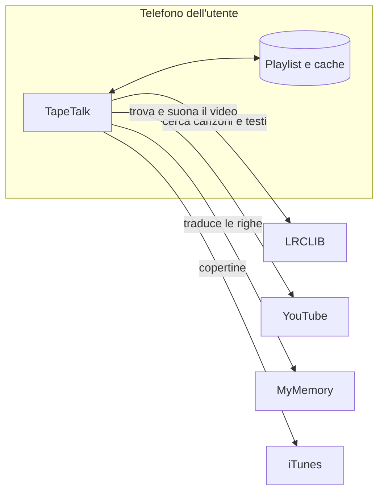
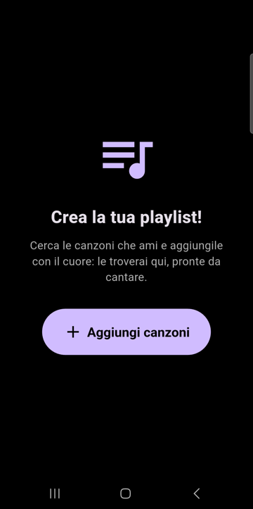

<p align="center">
  
</p>

# TapeTalk

**Sing along, learn along!**

TapeTalk è un'app Android (Flutter) per imparare l'inglese con le canzoni:
mentre la musica suona, il testo inglese scorre a tempo, le parole diventano
viola man mano che vengono cantate e sotto ogni riga compare la traduzione
italiana.

<p align="center">
  
  
  
  
</p>

## Architettura

TapeTalk **non ha un server e non ha account**. È solo uno strumento: prende
un collegamento che esiste già (il video della canzone su YouTube) e lo
trasforma in qualcosa di utile per imparare l'inglese, mettendogli accanto il
testo sincronizzato e la traduzione.

- **La playlist vive sul telefono di chi usa l'app.** I preferiti sono salvati
  solo lì (`shared_preferences`): ognuno ha i suoi, nessuno li vede e non
  passano da nessun server. Se si disinstalla l'app, si perdono.
- **Nessun contenuto delle canzoni è nel codice.** Audio, testi, traduzioni e
  copertine vengono letti al momento da servizi pubblici e, quando serve,
  salvati in cache sul telefono.
- **Una canzone è solo un riferimento**: titolo, artista, ID del video YouTube
  e durata. Da qui l'app ricava tutto il resto.



## Funzioni

- **La mia playlist** (*My favorites*): ognuno si crea la sua playlist, salvata
  sul telefono. Con la lista vuota l'app invita a crearla.
  <br>
- **Ricerca di canzoni nuove**: si cerca per titolo o artista e si aggiunge con
  il cuore. Compaiono solo le canzoni che hanno il testo sincronizzato; il
  video giusto viene cercato su YouTube in base alla durata.
- **Grande pulsante viola "Aggiungi canzoni"**, sempre in vista nella playlist.
- **Testo a tempo con la musica**: la riga corrente è evidenziata e **ogni
  parola diventa viola mentre viene cantata**. I tempi delle righe arrivano da
  LRCLIB; quelli delle singole parole sono stimati in base alla lunghezza
  delle parole.
- **Traduzione italiana** sotto ogni riga.
- Pausa / Play, **Ricomincia** e **velocità** di riproduzione
  (1× · 0,85× · 0,75×) senza distorcere la voce.
- **Logo**: un quadretto-bocca disegnato nello stile di un quadro, con un
  fumetto che alterna frasi di canzoni celebri e il nome del cantante
  (*Let it be* – The Beatles, *We will rock you* – Queen, *Imagine* – John
  Lennon, *Stayin' alive* – Bee Gees, *I will survive* – Gloria Gaynor).
  L'icona dell'app usa lo stesso quadretto, senza fumetto.
- **Numero di versione** in fondo alla pagina iniziale, per sapere quale
  versione c'è su ogni telefono.

## Da dove arrivano i dati

| Cosa | Fonte |
|---|---|
| Ricerca canzoni e testo sincronizzato | [LRCLIB](https://lrclib.net) |
| Video e audio | YouTube: ricerca con [youtube_explode_dart](https://pub.dev/packages/youtube_explode_dart), riproduzione con il player incorporato |
| Traduzioni | Musixmatch (se configurato per la canzone), altrimenti [MyMemory](https://mymemory.translated.net) |
| Copertine | iTunes Search API |

> ⚠️ Progetto sperimentale per uso personale. La lettura delle traduzioni da
> Musixmatch è provvisoria e non conforme ai loro termini d'uso: non usarla in
> un'app distribuita. Anche la ricerca dei video legge le pagine di YouTube
> senza le API ufficiali e può smettere di funzionare se YouTube le cambia.

## Avvio

```bash
flutter pub get
flutter run
```

Le canzoni suggerite si configurano in `lib/song.dart` (`catalog`); tutte le
altre si aggiungono dall'app con la ricerca.

## Versioni

Il numero di versione è in `pubspec.yaml` e ogni versione ha un tag git.

| Versione | Novità |
|---|---|
| 1.6.1 | Pulsante *My favorites* in inglese |
| 1.6.0 | Le parole diventano viola mentre vengono cantate |
| 1.5.0 | Frasi di canzoni nel logo; pulsante viola e invito a creare la playlist |
| 1.3.1 | Nuovo logo e icona con il quadretto-bocca |
| 1.2.0 | Ricerca di canzoni nuove; numero di versione nell'app |
| 1.1.0 | Preferiti personali salvati sul telefono |
| 1.0.0 | Prima versione |

## Struttura

- `lib/main.dart` – pagina iniziale, playlist, ricerca, scheda canzone
- `lib/favorites_store.dart` – la playlist, salvata sul telefono
- `lib/song_search.dart` – ricerca di canzoni (LRCLIB) e dei video (YouTube)
- `lib/song.dart` – modello della canzone e canzoni suggerite
- `lib/lyrics_screen.dart` – testo a tempo, parole viola e controlli
- `lib/lyrics_service.dart` – testo e traduzioni
- `lib/cover_service.dart` – copertine
- `lib/mouth_logo.dart` – logo quadretto-bocca con le frasi delle canzoni
- `test/icon_render_test.dart` – genera l'icona dell'app dal logo
- `docs/` – logo e screenshot per questo README

## Licenza

[MIT](LICENSE)
